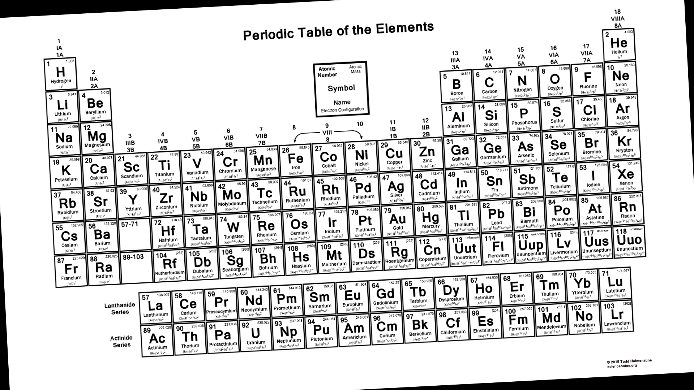
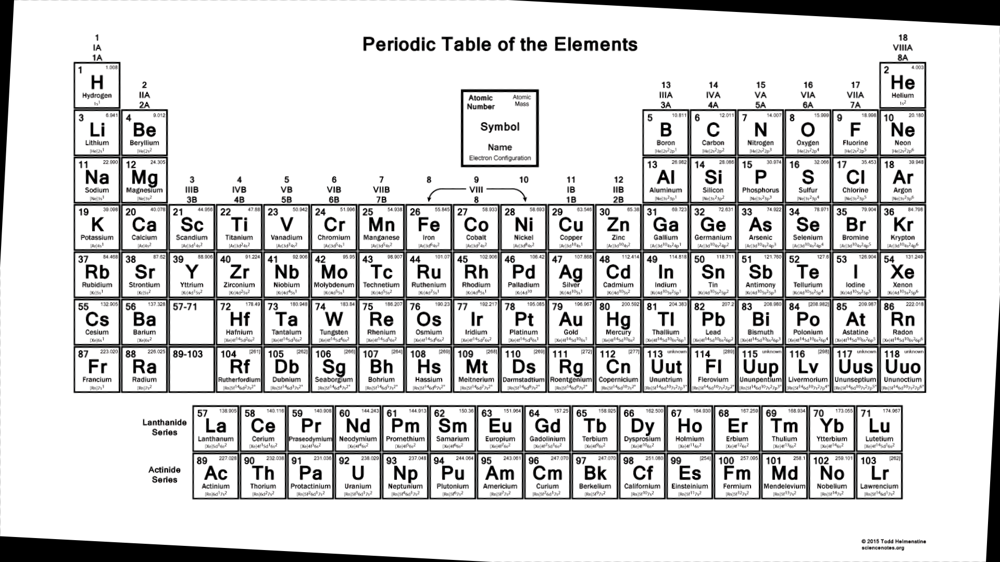

# OpenCV-periodictable

projeto criado para palestra dada pelo GDG - brasilia, tema: Visão computacional.  

A finalidade é de realizar operações morfologicas a fim de extrair cada bloco de elemnto da tabela periodica, utilizando a imagem:  

 

utilizando operações morfologicas para correção de rotação baseado na arcotangente das linhas verticais:  

 

Resultado da extração na pasta <b>data</b>
